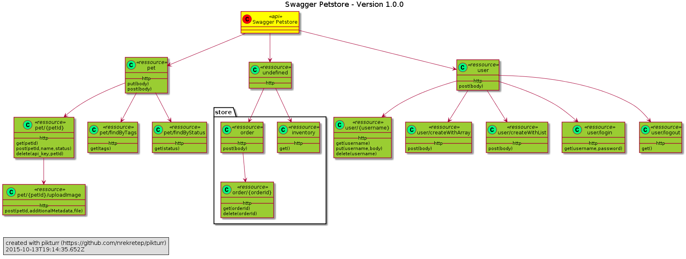

pikturr
=======

# Why? #

[swagger](http://swagger.io) is great tool to describe your restful api in a clear and structured way.
But as the spec gets longer and longer it could be sometimes useful to zoom out and look at your api from 10,000 feet.

__pikturr__ is a very simple tool to transform your swagger api spec into a simple uml class diagram.

# What? #

I'm new to the javascript and node party.
So please be patient and do not expect the ultra efficient javascript ninja code.
I find a visual representation of an api spec useful and I want to learn js and node...so I wrote this tool.
It's as simple as that.

# How? #

Because pikturr makes use of node-plantuml, which in turn makes use of...ehhh...[plantuml](http://plantuml.com/),
you have to fulfill some preconditions:
* you need to have the [java](https://www.java.com) executable in your path
* you must have [graphviz](http://www.graphviz.org/) installed
* the GRAPHVIZ_DOT environment variable must point the dot executable of graphviz

That's it for now.

Just get the code, look inside and you'll find out.

```
cd pikturr
npm install
 // modifiy the url in app.js to point to your swagger spec
node ./app.js

```



# What next? #

* re-structure code to meet nodejs project structure standards
* add some tests
* provide a rest api
* provide a simple web frontend
* provide some configurable options
